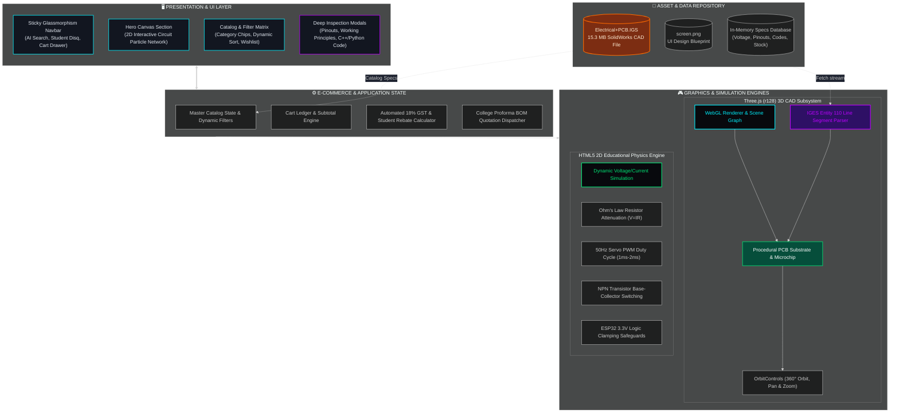
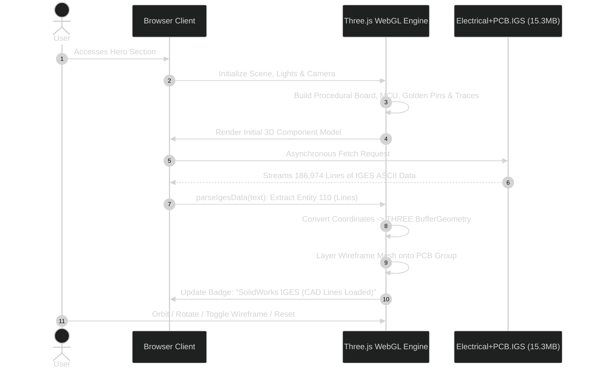
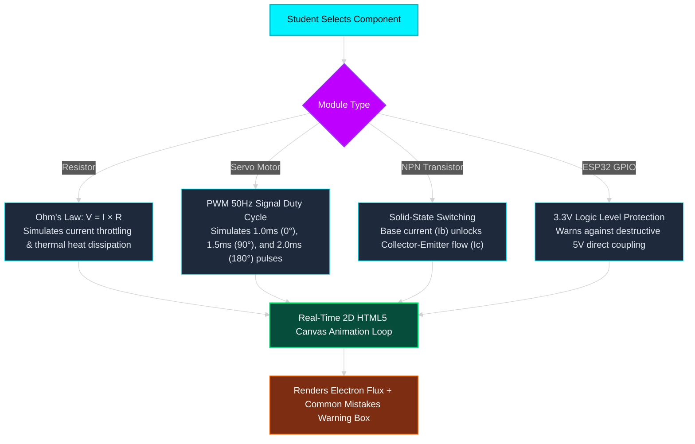

# ⚡ VOLT_ARCH — Next-Gen Precision Electronics & Hardware Infrastructure

<div align="center">


-FF6B00?style=for-the-badge&logo=autodesk&logoColor=white)


<p align="center">
  <strong>The precision-engineered e-commerce platform and interactive learning hub designed for engineering students, polytechnic labs, robotics clubs, and industrial manufacturing procurement.</strong>
</p>

[Explore Catalog](#-hardware-catalog--taxonomy) • [3D CAD Engine](#-3d-cad-iges-visualization-pipeline) • [Educational Hub](#-interactive-educational-simulation-hub) • [System Architecture](#-system-architecture) • [Setup & Run](#-local-setup--execution-guide) • [Viva Q&A](#-college-viva-voce--evaluation-guide)

</div>

---

## 📌 Problem Statement & Project Motivation

Engineering students and polytechnic laboratory managers constantly struggle with three core challenges when procuring electronic components:
1. **Lack of Functional Comprehension**: Traditional component websites display static, low-resolution images with unreadable datasheets, causing students to purchase incorrect parts or burn components by exceeding voltage/current limits.
2. **Inaccessible 3D Spatial Insights**: Evaluating physical PCB clearances, pin configurations, and form factors before fabrication requires complex CAD software installations that students often cannot access quickly.
3. **Friction in Institutional Procurement**: Colleges, hackathon teams, and robotics clubs needing bulk Bills of Materials (BOM) face manual paperwork hurdles for GST quotations and purchase orders (POs).

**VOLT_ARCH** bridges this gap by merging an **Apple/Tesla-grade dark glassmorphism storefront**, a real-time **browser-based 3D SolidWorks IGES CAD viewer**, hands-on **2D circuit simulations**, and a specialized **institutional bulk quotation engine**.

---

## 🏗 System Architecture



---

## 🔄 User Personas & Procurement Workflow

The system provides dual transaction pathways optimized for individual student makers versus formal institutional engineering departments:

```mermaid
%%{init: {'theme': 'dark'}}%%
flowchart LR
    Start([User Visits VOLT_ARCH]) --> Decision{Select User Role}

    %% Student Pathway
    Decision -->|Student / Hobbyist / Maker| Stu_Browse["Browse Catalog & Filter by Category"]
    Stu_Browse --> Stu_Inspect["Open 3D CAD or Product Spec Modal"]
    Stu_Inspect --> Stu_Edu["Test Circuit in Interactive Educational Hub"]
    Stu_Edu --> Stu_Disq["Toggle Student Discount (-10% Instant Rebate)"]
    Stu_Disq --> Stu_Cart["Add Items to Cart & View 18% GST Breakdown"]
    Stu_Cart --> Stu_Checkout["Instant Order & Tracking Generation"]

    %% Institutional Pathway
    Decision -->|Professor / Lab Head / Industry| Inst_PO["Open College Bulk PO Modal"]
    Inst_PO --> Inst_BOM["Input Institution Name, GSTIN & BOM Textarea"]
    Inst_BOM --> Inst_Submit["Submit Proforma Quotation Request"]
    Inst_Submit --> Inst_Process["Institutional Procurement Verification"]
    Inst_Process --> Inst_Invoice["Automated GST Invoice & Lab Dispatch"]

    %% Styling Nodes
    style Start fill:#00F2FF,stroke:#00B8C4,stroke-width:2px,color:#08090D
    style Decision fill:#BD00FF,stroke:#9333EA,stroke-width:2px,color:#FFFFFF
    style Stu_Browse fill:#1E293B,stroke:#00F2FF,stroke-width:1px,color:#E2E8F0
    style Stu_Inspect fill:#1E293B,stroke:#00F2FF,stroke-width:1px,color:#E2E8F0
    style Stu_Edu fill:#064E3B,stroke:#00E676,stroke-width:1px,color:#FFFFFF
    style Stu_Disq fill:#064E3B,stroke:#00E676,stroke-width:2px,color:#00E676
    style Stu_Cart fill:#1E293B,stroke:#00F2FF,stroke-width:1px,color:#E2E8F0
    style Stu_Checkout fill:#00F2FF,stroke:#00B8C4,stroke-width:2px,color:#08090D
    style Inst_PO fill:#2E1065,stroke:#BD00FF,stroke-width:2px,color:#E2E8F0
    style Inst_BOM fill:#1E293B,stroke:#BD00FF,stroke-width:1px,color:#E2E8F0
    style Inst_Submit fill:#7C2D12,stroke:#FF6B00,stroke-width:1px,color:#FFFFFF
    style Inst_Process fill:#1E293B,stroke:#FF6B00,stroke-width:1px,color:#E2E8F0
    style Inst_Invoice fill:#00E676,stroke:#059669,stroke-width:2px,color:#08090D
```



---

## 💎 Key Feature Highlights

### 1. 3D CAD IGES Visualization Pipeline
Rather than relying solely on pre-rendered images, VOLT_ARCH incorporates a WebGL client-side parser for native CAD data:



- **Procedural Substrate**: FR-4 substrate mesh, high-density IC microcontroller, metallic shield, dual gold header rows, and SMD passive components.
- **Parametric IGES Parsing**: Scans for **Entity 110** (straight lines), extracts starting `(X1, Y1, Z1)` and ending `(X2, Y2, Z2)` vectors, scales them into WebGL world coordinates, and renders an accurate physical CAD wireframe overlay.
- **Full Viewport Interactivity**: Seamless orbit, pan, zoom, auto-rotation toggle, and wireframe analysis.

---

### 2. Interactive Educational Simulation Hub
Students can analyze component behavior under simulated load before purchasing:



- **Resistors**: Visualizes electron restriction and provides warnings against connecting unregulated 5V/12V rails directly to low-forward-voltage LEDs.
- **Servo Motors**: Explains 50Hz PWM pulse-width angle control and warns against power rail brownouts caused by pulling servo current from microcontroller 5V headers.
- **Transistors**: Details small base currents gating large collector loads, with flyback diode protection tips for inductive coils.
- **ESP32 Microcontrollers**: Details 3.3V ADC logic ceilings and voltage divider usage.

---

### 3. Deep-Dive Product Inspection Modal
Clicking any component triggers an inspection modal with 3 dedicated engineering tabs:
1. **Pinout Configuration**: Interactive badges mapping physical pins (`3V3`, `GND`, `GPIO ADC/DAC`, `I2C SDA/SCL`, `SPI`, `PWM`).
2. **Internal Working Mechanism**: Physical and semiconductor breakdown (MEMS capacitive deflection, Hall-effect commutation, PID heater tracking).
3. **Executable Code Snippets**: Pre-configured, copy-pasteable Arduino C++ and Raspberry Pi Python scripts with library declarations.

---

## 📦 Hardware Catalog & Taxonomy

| Product Name | Category | Operating Voltage | Rating | In Stock | Key Engineering Application |
| :--- | :--- | :--- | :---: | :---: | :--- |
| **ESP32-S3 Dual-Core** | Microcontrollers | `3.3V / 5V USB` | 4.9 ★ | 84 | Edge AI, WiFi/BLE IoT gateways, robotics |
| **Arduino Uno R4 WiFi** | Microcontrollers | `5V (6-24V VIN)` | 4.8 ★ | 45 | RA4M1 ARM Cortex-M4, 12x8 LED matrix |
| **Raspberry Pi 5 (8GB)** | Microcontrollers | `5V / 5A USB-C PD`| 5.0 ★ | 19 | Dual 4K displays, PCIe 2.0, autonomous AI |
| **MPU6050 6-DOF IMU** | Sensors | `3.3V - 5V I2C` | 4.7 ★ | 120 | Triple-axis gyro/accel, drone balance |
| **SG90 Micro Servo (9g)**| Motors | `4.8V - 6.0V` | 4.6 ★ | 300 | Robotic arms, pan-tilt camera gimbals |
| **NEMA 17 Stepper Motor**| Motors | `12V - 24V DC` | 4.9 ★ | 50 | 3D printers, CNC milling machines |
| **TS101 Smart Iron (65W)**| Tools | `9V-24V / USB-PD` | 4.9 ★ | 35 | Lab precision soldering, STM32 firmware |
| **1000W BLDC Engine** | Industrial | `48V - 72V DC` | 5.0 ★ | 12 | Electric vehicle drives, industrial CNC spindles |
| **IoT Agriculture Kit** | Kits | `5V USB` | 4.9 ★ | 60 | Soil sensors, automated pump, OLED screen |
| **Quadcopter Drone Kit** | Kits | `11.1V 3S LiPo` | 4.8 ★ | 25 | F450 frame, 2212 motors, APM flight controller |
| **100MHz Oscilloscope** | Tools | `100V - 240V AC` | 5.0 ★ | 8 | 1GS/s sampling, dual BNC, FFT spectrum analyzer |
| **0.96" I2C OLED Module** | Sensors | `3.3V - 5V` | 4.7 ★ | 200 | SSD1306 128x64 display, low power |

---

## 📂 Project Structure & Modular Organization

```plaintext
MRN/
├── index.html            # Primary modular HTML5 entry point with semantic markup
├── code.html             # Original standalone single-file prototype backup
├── css/
│   └── style.css         # Glassmorphism, neon glow effects, animations, scrollbars
├── js/
│   └── app.js            # Three.js CAD engine, simulation loop, catalog & cart state
├── Electrical+PCB.IGS    # SolidWorks 2014 ASCII CAD model (15.3 MB, 186,974 lines)
├── screen.png            # High-resolution visual design mockup & reference
└── README.md             # Complete academic documentation & project report
```

---

## 🚀 Local Setup & Execution Guide

Because the Three.js CAD engine asynchronously streams the 15.3 MB [`Electrical+PCB.IGS`](file:///c:/Users/ASUS/OneDrive/Desktop/Solo%20Projects/MRN/Electrical+PCB.IGS) CAD model via standard Web APIs (`fetch()`), modern web browsers enforce security policies (CORS) that block `file:///` AJAX requests. 

To run the project locally with complete 3D CAD loading:

### Method 1: Python HTTP Server (Recommended)
Open PowerShell or Command Prompt in the project folder and execute:
```powershell
# Python 3.x
python -m http.server 8000
```
Then navigate to: **`http://localhost:8000/index.html`**

### Method 2: Node.js (npx serve)
```bash
npx serve .
```
Then open the displayed local URL (usually `http://localhost:3000`).

### Method 3: VS Code Live Server Extension
1. Open the project folder in VS Code.
2. Right-click [`index.html`](file:///c:/Users/ASUS/OneDrive/Desktop/Solo%20Projects/MRN/index.html).
3. Click **"Open with Live Server"**.

---

## 🎓 College Viva Voce & Evaluation Guide

Here are concise answers to anticipated questions from professors or project evaluators:

<details>
<summary><strong>Q1: Why parse an IGES file in the browser instead of using simple STL or OBJ?</strong></summary>

> **Answer:** IGES (Initial Graphics Exchange Specification, ANSI standard) is the native cross-platform format output by CAD suites like SolidWorks, Siemens NX, and Autodesk Inventor. While STL only stores triangular facet approximations losing edge fidelity, IGES preserves exact parametric curve and entity data (such as Entity 110 lines and Entity 120 surfaces). Our parser reads the parameter block directly to render true engineering line definitions with zero server-side pre-rendering overhead.
</details>

<details>
<summary><strong>Q2: How does the client-side state handle the Student Discount and GST billing?</strong></summary>

> **Answer:** State is managed reactively in `js/app.js`. When the user toggles the Student Discount flag (`isStudentDiscountActive`), the catalog dynamically applies a 10% reduction ($\text{Price} \times 0.9$). In the cart drawer, subtotal, 10% student rebate deductions, and statutory 18% GST ($\text{Subtotal} \times 0.18$) are dynamically re-tallied per item quantity change without full page reloads.
</details>

<details>
<summary><strong>Q3: How is 60 FPS performance maintained with a 15 MB CAD file?</strong></summary>

> **Answer:** We decouple initial DOM rendering from CAD file parsing. Three.js immediately constructs a lightweight procedural PCB substrate and chip mesh so the user experiences zero layout shift. The 15 MB file is streamed asynchronously; only wireframe lines (Entity 110) are pushed into a consolidated `THREE.BufferGeometry` using typed Float32 arrays, minimizing GPU draw calls and avoiding memory leaks.
</details>

<details>
<summary><strong>Q4: How does the educational simulation engine work?</strong></summary>

> **Answer:** Built directly upon the HTML5 Canvas 2D context, it executes an animation loop using `setInterval`/`requestAnimationFrame`. It translates theoretical electronics formulas (such as Ohm's Law and PWM square wave periods) into visual electron velocities, colored pulse nodes, and dynamically bound cautionary text blocks.
</details>

---

## 🛡️ License & Academic Citation

Developed for academic demonstration and engineering education.
- **Course**: Web Engineering & Embedded Systems Laboratory Project
- **Target Platform**: Desktop & Mobile Responsive Web Browsers (Chrome, Firefox, Safari, Edge)
- **Year**: 2026
